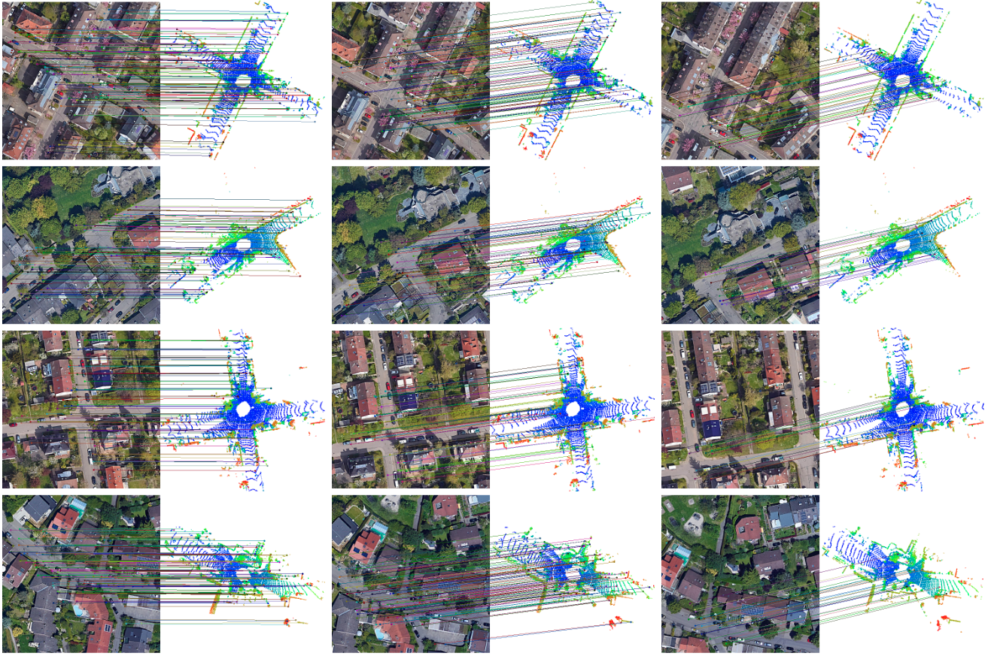
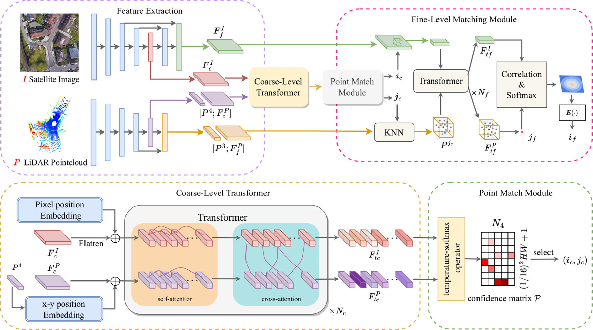

# D-GLSNet
The code of Geo-localization with Transformer-based 2D-3D match Network

## Introduction
D-GLSNet is a Transformer-based 2D-3D matching network that directly matches the LiDAR point clouds and satellite images through end-to-end learning. Without the need for feature point detection, D-GLSNet provides accurate pixel-to-point association between the LiDAR point clouds and satellite images. And then, we can easily calculate the horizontal offset (Δx,Δy) and angular deviation Δθ(yaw) between them, thereby achieving accurate registration. Extensive experiments on the KITTI dataset show that our D-GLSNet method achieves a mean Relative Translation Error (RTE) of 1.43 m.


## Installation
```bash 
 # create env
conda create --name D-GLSNet python=3.8 -y
conda activate D-GLSNet

# Install PyTorch and torchvision
pip install torch==1.13.0+cu116 torchvision==0.14.0+cu116 torchaudio==0.13.0 --extra-index-url https://download.pytorch.org/whl/cu116

 # Install packages and other dependencies
pip install -r requirements.txt
python setup.py build develop

```

## Architecture


## Dateset
Our data is based on Kitti and Kitti-360, and we provide a simple example data on Kitti.
```
sample
├── train.txt
├── val.txt
├── test.txt
├── Kitti
│   ├── 2011_10_03/2011_10_03_drive_0027_sync/data
│   │   ├── 0000000000.npz
│   │   ├── 0000000001.npz
│   │   ├── ...

```

Each. npz file contains four arrays:
* Point: LiDAR point cloud;
* Map_: Google Map of the current frame LiDAR point cloud attachment;
* Scale: The scale of Google Maps;
* Focal: LiDAR point relative map_ The pixel coordinates of the offset of the center position;

## Train 
Modify the `run_path` in the configuration file **default_kitti.yaml** to modify the output path, and modify the value of the `root` of data to modify the data directory. Use the following command for training.
```bash
CUDA_VISIBLE_DEVICES=0 python train.py pl_DGLSNet ./config/default_kitti.yaml kitt_train
```

* 

## Test

Modify `pretrained` in the default_kitti.yaml file to load the corresponding model. Use the following command for testing.

```bash
CUDA_VISIBLE_DEVICES=0 python train.py pl_DGLSNet ./config/default_kitti.yaml kitt_train --test
```

## Citation

```c
@ARTICLE{10168166,
  author={Li, Laijian and Ma, Yukai and Tang, Kai and Zhao, Xiangrui and Chen, Chao and Huang, Jianxin and Mei, Jianbiao and Liu, Yong},
  journal={IEEE Robotics and Automation Letters}, 
  title={Geo-Localization With Transformer-Based 2D-3D Match Network}, 
  year={2023},
  volume={8},
  number={8},
  pages={4855-4862},
  doi={10.1109/LRA.2023.3290526}}
```

